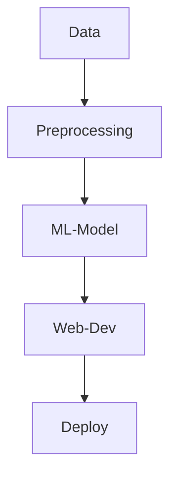

# ML-Movie-Recommender-System
Hey there 🙋🏻‍♂️!! This repo contains my Movie Recommender System based on Machine Learning (ML). You will get to see i) Data processing ii) ML (⊂ AI) techniques iii) Web development iv) Deployment, its a lot of work👷🏻! Enjoy your walk👣 through the repo, Feel free to raise PR if you think we can improve.

## Keywords / Tags
- ```Python```
    - ```numpy``` ```pandas``` ```sklearn``` ```nltk```
- ```Data Pre-processing```
    - ```Missing Value Handling``` ```Duplicate Removal``` ```Data Cleaning```
- ```Machine Learning```
    - ```Cosine Similarity``` ```Bag of Words(BoW) model``` ```Feature Extraction``` ```Feature Selection``` 
- ```Recommender Systems```
    - ```Content-based``` ```Collaborative Filtering```

## Repository Structure
```
├── readme.md         # Must read to understand what is done
├── LICENSE           # Permissions
```

## Table Of contents
| S.No | Heading | What it conveys? |
|:---|:--|:--|
| 1 | [Introduction](#introduction)| Introduces recommender systems, ML concepts |

## Recommender Systems
Does useful recommendations for user. Like when you are seeing about tomato you should not get items like mosquito net. 🚨

### Types Of Recommender Systems
1) Content based
    -  Recommending new content based on similarity with query + already watched content
    - Example: Youtube recommending test cricket video, as you searched for cricket
2) Collaborative filtering
    - Based on interests of user
    - Example: Based on history if A and B has high similarity, then if A watched something new then the new stuff can be recommended to B
3) Hybrid

## Machine Learning (ML) 🤖
- Feature engineering in ML
    - **Feature Extraction**
        - Transforming arbitary / raw data into numerical features, so that ML can be used.
        - To capture useful information in a way that models can understand better.
        - We can convert text into vectors using:
            1. Bag of Words (BoW) model
            2. TF-IDF
            2. Word2Vec
    - **Feature Selection**
        - Choosing useful features.
        - Because there could be lot of unnnessary (or) irrelevant features, so you will have to choose relavant ones. 

- To get how close the vectors are (when to use Euclidian distance and when to use Cosine similarity??):
    | Feature | Euclidean Distance| Cosine Similarity|
    |:----------------------|:--|:--|
    | Measures               | Absolute distance (magnitude) | Angle (direction)                     |
    | Sensitive to magnitude | ✅ Yes                         | ❌ No                                  |
    | Works well with        | Low-dim, dense data  (e.g, Image pixels)         | High-dim, sparse data (e.g., NLP)     |
    | Range                  | \[0, ∞)                       | \[-1, 1] (or \[0, 1] if non-negative) |
    | Problem in high-dim    | Curse of dimensionality       | Robust in high-dimensional space      |


## This Project
This repo builds **Content Based Movie Recommender System** using Machine Learning, which is cool😎!! The techniques used in here, can be used else where from document retreival to ecommerce development, from search engine to social media content.



## Citations
- [English stop words](https://gist.github.com/sebleier/554280)
- [YouTube tutorial](https://www.youtube.com/watch?v=1xtrIEwY_zY&t=1s)
- [ProtoBuf documentation](https://protobuf.dev/)
- [Bag of Words (BoW) Model](https://en.wikipedia.org/wiki/Bag-of-words_model)
